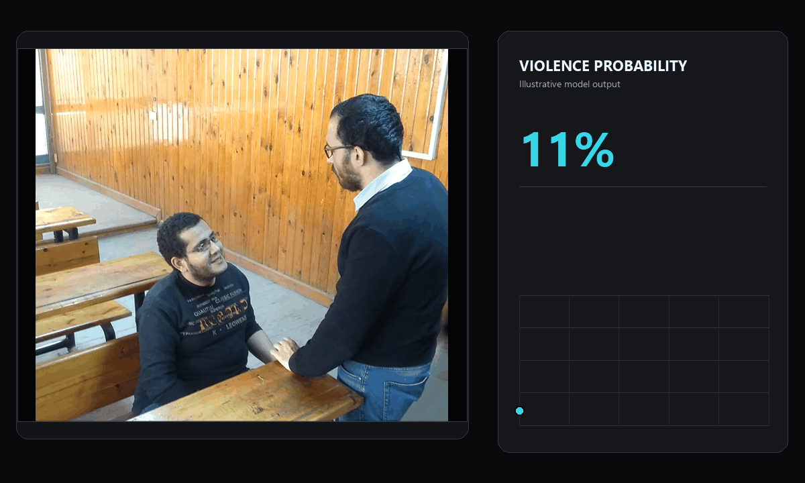

<div align="center">

# Spatiotemporal Violence Detection

### Efficient video violence detection using a frozen ResNet50 and a lightweight temporal Transformer


</div>

<!--
Add the header image after uploading assets/header.png:

<p align="center">
  
</p>
-->

## Overview

This project presents a modular architecture for detecting violent activity in video footage by separating spatial feature extraction from temporal reasoning.

A frozen **ResNet50** extracts semantic representations from individual video frames. The resulting frame embeddings are projected into a compact feature space and processed by a lightweight **Transformer Encoder**, which models temporal relationships across the complete video sequence.

The architecture is designed to balance:

* Strong classification performance
* Computational efficiency
* Support for variable-length videos
* Modular spatial and temporal components

## Key Results

<table>
  <tr>
    <td align="center">
      <strong>F1-score</strong><br><br>
      <span style="font-size: 26px"><strong>0.963</strong></span>
    </td>
    <td align="center">
      <strong>Balanced Accuracy</strong><br><br>
      <span style="font-size: 26px"><strong>0.962</strong></span>
    </td>
    <td align="center">
      <strong>Test Videos</strong><br><br>
      <span style="font-size: 26px"><strong>300</strong></span>
    </td>
  </tr>
</table>

The model achieves strong performance on the held-out test set while maintaining a balanced error profile across violent and non-violent videos.

Cross-dataset evaluation reveals a substantial decline in generalization performance, highlighting domain shift and limited training-data diversity as the main remaining challenges.

## Example Inference

<!--
Replace this section after uploading assets/demo.gif:

<p align="center">
  
</p>
-->

> A short precomputed inference visualization will be added here. It will show sampled frames, predicted violence probability over time, and the final classification.

## Architecture


### Processing Pipeline

1. Videos are sampled into sequences of RGB frames.
2. A frozen ResNet50 extracts a semantic representation from every frame.
3. Frame features are projected from 2,048 to 256 dimensions.
4. Sinusoidal positional encoding preserves temporal order.
5. A Transformer Encoder models short- and long-range temporal relationships.
6. Padding masks support videos with different sequence lengths.
7. Masked mean pooling produces one video-level representation.
8. An MLP classification head predicts the probability of violence.

## Why This Architecture?

### Efficient spatial feature extraction

Using a pretrained and frozen ResNet50 reduces the number of trainable parameters and lowers the computational cost of training.

### Long-range temporal reasoning

The Transformer Encoder can model relationships between distant frames and capture escalation patterns across a video sequence.

### Variable-length video support

Padding masks prevent artificial padded frames from influencing attention calculations or the final video representation.

## Results

### Held-Out Test Performance

| Metric            | Value |
| ----------------- | ----: |
| Accuracy          | 0.962 |
| Balanced Accuracy | 0.962 |
| Precision         | 0.960 |
| Recall            | 0.966 |
| F1-score          | 0.963 |
| False Positives   |     6 |
| False Negatives   |     5 |

### Confusion Matrix

|                       | Predicted Non-Violence | Predicted Violence |
| --------------------- | ---------------------: | -----------------: |
| **True Non-Violence** |                    137 |                  6 |
| **True Violence**     |                      5 |                144 |

<!--
A visual confusion matrix can later replace or supplement this table:

<p align="center">
  
</p>
-->

## Cross-Dataset Generalization

The model was additionally evaluated on an external violence-detection dataset containing visually and semantically different scenarios.

| Evaluation Setting                | Accuracy |
| --------------------------------- | -------: |
| Held-out in-distribution test set |    0.962 |
| External cross-dataset evaluation |    0.669 |

The model retained relatively high sensitivity to violent events but produced substantially more false positives for unfamiliar non-violent interactions.

This suggests that the main generalization bottleneck is not necessarily the temporal architecture itself, but the diversity and representativeness of the training data.

## Repository Structure

```text
spatiotemporal-violence-detection/
├── README.md
├── requirements.txt
├── src/
│   └── violence_detection.py
├── demo/
│   ├── inference_demo.ipynb
│   └── sample_predictions.json
├── assets/
│   ├── header.png
│   ├── pipeline.png
│   ├── demo.gif
│   └── confusion_matrix.png
├── paper/
│   └── violence_detection_paper.pdf
└── results/
    └── metrics.json
```

## Installation

Clone the repository:

```bash
git clone https://github.com/lourencodebonnet/spatiotemporal-violence-detection.git
cd spatiotemporal-violence-detection
```

Install the required dependencies:

```bash
pip install -r requirements.txt
```

## Usage

The cleaned training, evaluation, and inference commands will be documented after the main implementation file has been added.

Planned usage documentation:

* Dataset preparation
* Frame extraction and preprocessing
* Model training
* Checkpoint evaluation
* Inference on an individual video
* Generation of prediction visualizations

## Dataset

The model was trained and evaluated using the **Real Life Violence Situations Dataset**, containing 2,000 balanced video clips:

* 1,000 violence videos
* 1,000 non-violence videos

The dataset itself is not redistributed through this repository. Please obtain it from its original source and follow the original dataset license and usage conditions.
https://www.kaggle.com/datasets/mohamedmustafa/real-life-violence-situations-dataset 

## Paper

The full research paper describes the architecture, preprocessing strategy, augmentation methods, experiments, results, and cross-dataset evaluation.

[Read the full paper](paper/violence_detection_paper.pdf)

## Limitations and Responsible Use

This project is a research prototype and should not be interpreted as a deployment-ready surveillance system.

Important limitations include:

* Performance can decline substantially under domain shift.
* False positives may occur in sports, physical play, crowded scenes, and friendly physical interactions.
* Dataset-specific visual characteristics may enable shortcut learning.
* Predictions may be affected by camera motion, video quality, lighting, compression, and recording style.
* The model has not been validated for autonomous policing or other high-stakes decision-making.
* Model outputs should always be reviewed by a qualified human operator.
* A prediction should never be treated as proof that violent behavior occurred.

## Future Work

Potential extensions include:

* More diverse non-violent training examples
* Domain-adaptive training
* Larger cross-dataset evaluations
* Attention and temporal-importance visualizations
* Multimodal modeling using video and audio
* More efficient inference for real-time applications
* Improved calibration and uncertainty estimation

## Authors

* Lourenco Debonnet
* Marvin Hahne
* Kevin Le

## Citation

A formal citation will be added alongside the final version of the paper.

## License

No open-source license has currently been assigned. Please contact the authors before reusing the code or other project materials.
